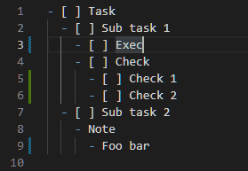

# Switch Markdown Check Box

## About

- Toggle check box on/off.  
  チェックボックスの切り替えを行います。

- Supporting nested check box, as OrgMode.  
  OrgMode の様に、入れ子のチェックボックスに対応しています。

## Commands

 - `Toggle Check Box`
 - `Check Box Switcher:Enable Auto Maintenance`
 - `Check Box Switcher:Disable Auto Maintenance`

# Link

* [GitHub](https://github.com/kuone314/VSCodeToggleCheckBox)
* [Twitter](https://twitter.com/KuoneTech)
